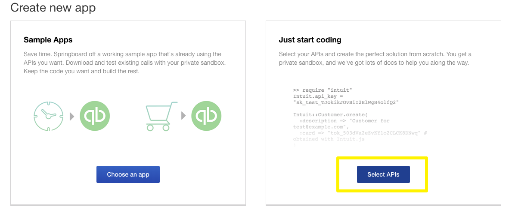
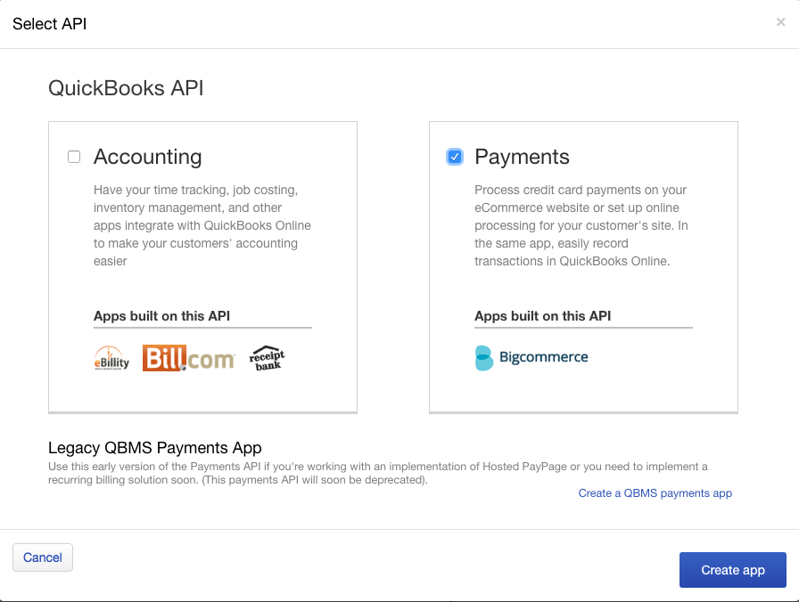
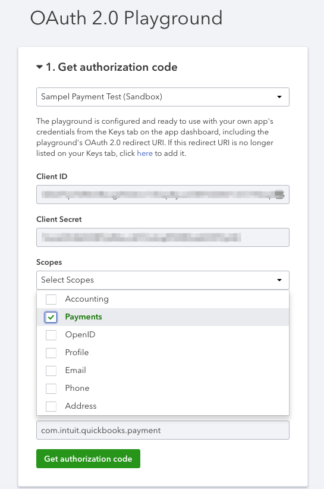

Intuit Payment Sample - NodeJS
==========================================================

## Overview

This is a `Sample` app built using Node.js and Express Framework to showcase how to make API calls using the [Intuit-Payment API's](https://developer.intuit.com/docs/00_quickbooks_payments/2_build/20_explore_the_quickbooks_payments_api)


## Installation

### Requirements

* [Node.js](http://nodejs.org) >= 8.x.
* [Intuit Developer](https://developer.intuit.com) Account

### Via Github Repo (Recommended)

```bash
$ git clone abisalehalliprasan/intuit-payment-sample-nodejs
$ cd intuit-payment-sample-nodejs
$ npm install
```

## Pre-requisites

### Create an App
* **Create an Intuit Developer account and app**:  
  You must have an Intuit Developer account and have created an app. To know more refer to [Get Started](https://developer.intuit.com/docs/00_quickbooks_online/1_get_started/00_get_started) 
* **Create an App with Payment Scope**:    
  Login to [Developer Portal](https://developer.intuit.com) and click on `My Apps` on the top right corner and create an App as shown below  
   
  Select the `Payments` scope while creating the app.
  


### Get Access Token from OAuth Playground
* **Get AccessToken**:  
  Use [OAuth Playground](https://developer.intuit.com/v2/ui#/playground) to get the OAuth2.0 accessToken from the app you just created above.   
  Note: Please make sure to select Payment Scope   
  

## Configuration

Copy the contents from `.env.example` to `.env` from the root directory:
```bash
$ cp .env.example .env
```
Edit the `.env` file to add your:  

* **ACCESS_TOKEN:** You can generate `accessToken` using the [OAuth Playground](https://developer.intuit.com/v2/ui#/playground)
* **NGROK_ENABLED:(optional)** By default it is set to `false`. If you want to serve the Sample App over HTTPS, set the variable to `true` 
* **PORT:(optional)** Optional port number for the app to be served

** Please note, that we are testing this Sample in **Sandbox Environment**. To test in Production please use the below `.env` variables:
* TOKEN_URL=`https://sandbox.api.intuit.com/quickbooks/v4/payments/tokens`    
* CHARGE_URL=`https://sandbox.api.intuit.com/quickbooks/v4/payments/charges`


### TLS / SSL (**optional**)

If you want your enpoint to be exposed over the internet. The easiest way to do that while you are still developing your code locally is to use [ngrok](https://ngrok.com/).  

You dont have to worry about installing ngrok. The sample application does that for you.   
1. Just set `NGROK_ENABLED` = `true` in `.env` 


## Usage

```bash
$ npm start
```

### Without ngrok (if you are using localhost to serve the sample app i.e `NGROK_ENABLED`=`false` in `.env`)
You will see an URL as below:
```bash
💻 Server listening on port 8000  
💳 See the Sample App in your browser: http://localhost:8000
```


### With ngrok (if you are using ngrok i.e `NGROK_ENABLED`=`true` in `.env`)

Your will see an URL as below : 
```bash
💻 Server listening on port 8000  
💳 See the Sample App in your browser: https://9b4ee833.ngrok.io
```

Click on the URL and follow through the instructions given in the sample app.

## Links

Project Repo

* https://github.com/abisalehalliprasan/intuit-payment-sample-nodejs

Intuit Payment API Reference

* https://developer.intuit.com/docs/api/payments

Intuit Payments API Explorer

* https://developer.intuit.com/v2/apiexplorer?apiname=Payments

## Contributions

Any reports of problems, comments or suggestions are most welcome.

Please report these on [Issue Tracker in Github](https://github.com/abisalehalliprasan/intuit-payment-sample-nodejs).
